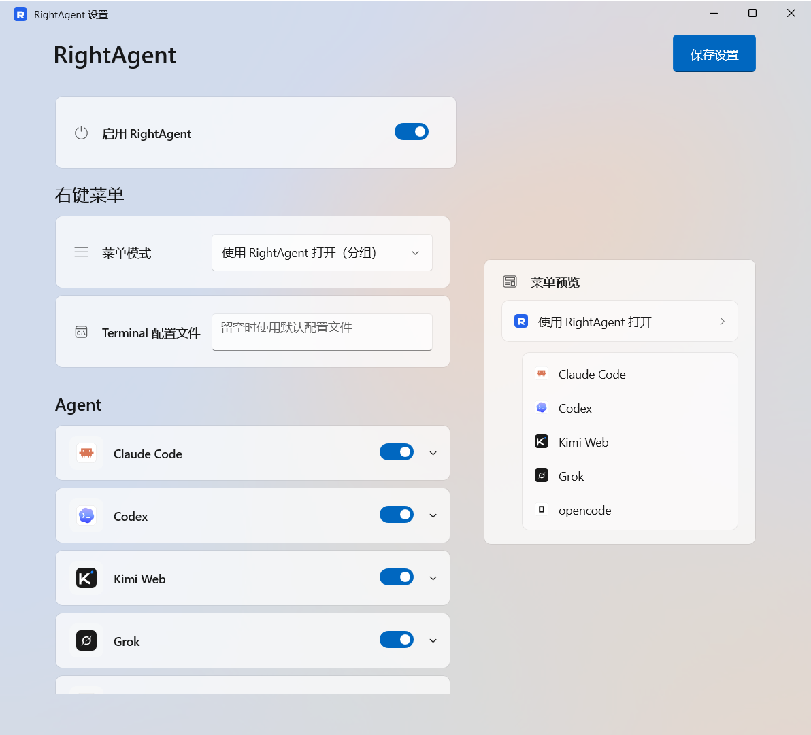
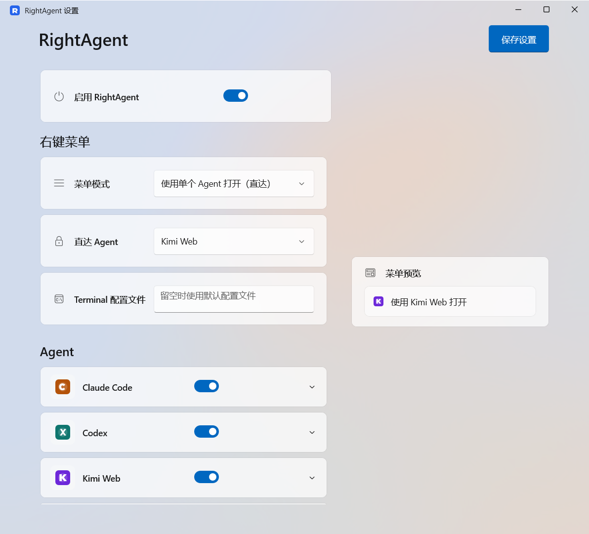
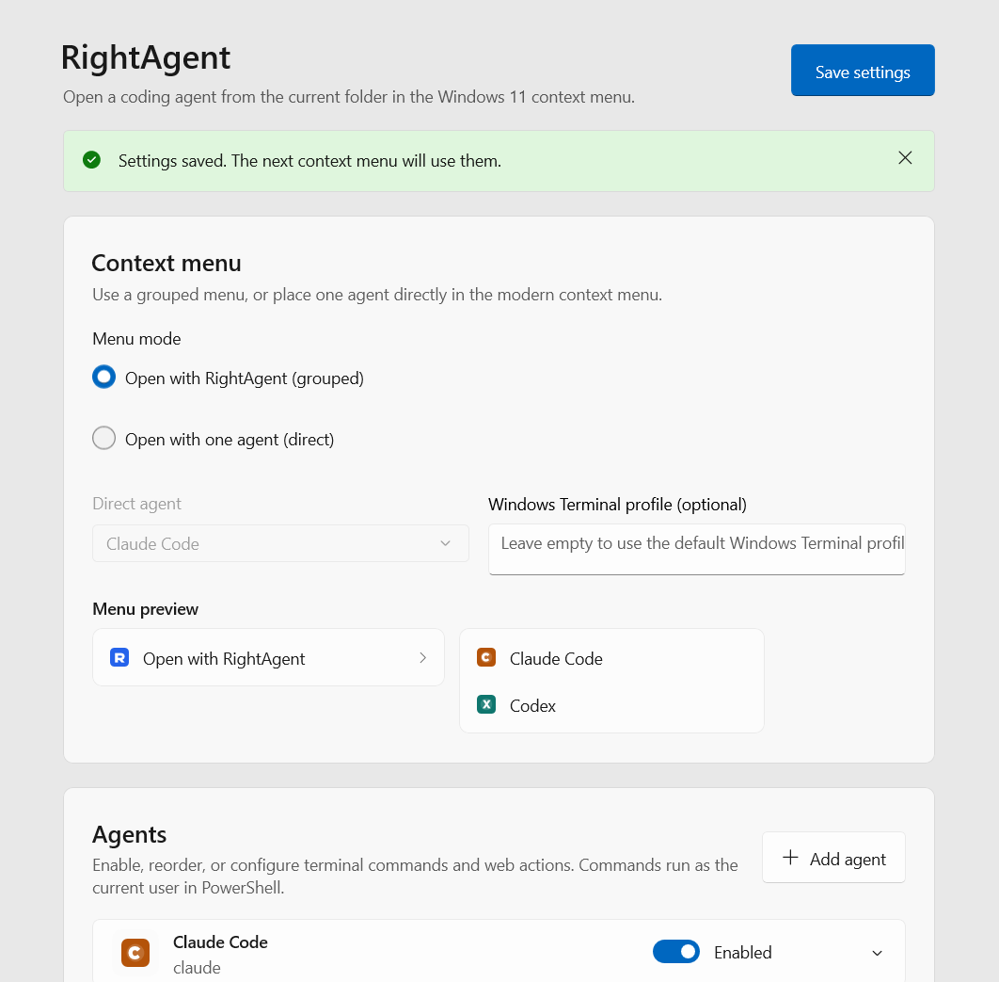

# RightAgent

**简体中文** | [English](README.en.md)


**把 AI 编程助手装进 Windows 11 的右键菜单。**

当前版本：v1.1.4 · [MIT 许可证](LICENSE)

```text
使用 RightAgent 打开  >
    Claude Code
    Codex
    Kimi
    Grok
    opencode
    Cursor Agent
```

在文件夹空白处或选中一个文件夹后点击右键，即可用喜欢的 AI 编程助手打开当前目录。RightAgent 支持分组菜单、单个 Agent 直达，以及把多个已启用 Agent 同时放在右键菜单根目录的多个直达模式。菜单模式、启用状态、排列顺序、命令、网址、图标、界面语言和 Windows Terminal 配置文件，都可以在 WinUI 3 设置应用中统一管理。

RightAgent 没有托盘进程、后台服务、遥测或自动更新；关闭设置窗口后，程序会完全退出。



## 功能特性

- **三种菜单模式**：分组子菜单、单个 Agent 直达，或按配置顺序显示全部已启用 Agent 的多个直达命令。
- **六个内置助手**：Claude Code、Codex、Kimi、Grok、opencode 和 Cursor Agent，开箱即用。
- **完全可定制**：可以添加、重命名、启停和排序任意助手；动作支持终端命令或 `http`、`https` 网址。
- **自定义图标**：本地 PNG、JPG、BMP、ICO 文件会自动规范化为 ICO。
- **双语界面**：可以跟随系统，也可以明确选择简体中文或英文。
- **沿用 Windows Terminal 配置文件**：打开标签页时使用该配置文件自己的 Shell、图标和配色，不再另外选择命令解释器。
- **总开关**：一键停用或启用整个右键菜单。
- **实时预览**：右侧即时展示菜单最终效果；设置采用原子写入，文件损坏时会自动备份并重建。

| 直达模式 | 英文界面 |
| --- | --- |
|  |  |

## 运行环境

- Windows 11 x64，系统版本 22000 或更新。
- Windows Terminal（`wt.exe`）。

## 安装

请从[官方 GitHub Release](https://github.com/y0ung-jg-1/RightAgent/releases/latest)下载 `RightAgent-1.1.4-x64-Setup.exe` 与同名 `.sha256` 文件，核对 SHA-256 后双击安装。默认安装器是本机版，需要管理员批准，设置应用装到 `%ProgramFiles%\RightAgent`。只要当前用户安装可用 `RightAgent-1.1.4-x64-UserSetup.exe`。安装器界面跟随 Windows 显示语言（中文 / 英文）。首次安装会把项目公共证书导入“本地计算机\受信任的人”，设置写在 `%LOCALAPPDATA%\RightAgent`，并只注册当前菜单需要的命令包。为避免 Windows 11 把多个直达命令归组，Setup 内部包含 16 个隐藏命令包，但用户仍只需下载一个 EXE，开始菜单也只显示一个 RightAgent。发布包不包含私钥。完整步骤与安全说明见[侧载安装说明](docs/SIDELOAD_INSTALL.md)。

### 从源码开发

创建与包清单匹配的按用户开发证书，然后构建、签名并安装：

```powershell
.\scripts\New-DevCertificate.ps1
.\scripts\Build.ps1 -Configuration Release
.\scripts\Sign-PackageSet.ps1 -Configuration Release
.\scripts\Install-DevPackage.ps1 -Configuration Release
```

也可以一键完成构建、签名和安装。设置保存在 `%LOCALAPPDATA%\RightAgent`。

```powershell
.\scripts\Install-DevBuild.ps1
```

证书文件会写入已被忽略的 `.local\signing` 目录。请勿提交或分享 PFX。首次安装时，`Install-DevPackage.ps1` 会请求管理员批准，仅将公共 CER 导入“本地计算机\受信任的人”，不会加入“受信任的根证书颁发机构”。不再需要时，请移除该开发证书。

只调试设置界面、不注册资源管理器菜单时，可以运行：

```powershell
.\scripts\Run-SettingsApp.ps1
```

## 行为说明

- 右键文件夹空白处时使用当前文件夹；右键单个选中的文件夹时使用被选文件夹。
- 对文件、多选、虚拟文件夹和非文件系统位置，菜单会自动隐藏或禁用。
- 终端动作会打开新的 Windows Terminal 窗口，并使用所选配置文件自己的 Shell。助手退出后，终端窗口保持打开。
- 设置应用启动时会检测 `wt.exe`；未检测到 Windows Terminal 时，会说明原因并提供 Microsoft Store 安装入口。
- 网址动作只允许 `http` 和 `https`。
- 在打开终端前会检测可执行文件；缺失时，错误窗口会提供打开 RightAgent 设置的按钮。
- 设置会原子写入 `%LOCALAPPDATA%\RightAgent\settings.json`。

内置助手图标使用 [@lobehub/icons](https://github.com/lobehub/lobe-icons)（MIT）字形，全部随应用本地打包，运行时不会联网获取。版权声明见[第三方声明](THIRD_PARTY_NOTICES.md)，商标与公开发版要求见[品牌资产策略](docs/BRAND_ASSETS.md)。

## 构建与测试

```powershell
.\scripts\Test.ps1 -Configuration Debug
.\scripts\Build.ps1 -Configuration Release
```

构建产物是 `artifacts\package\Release` 下的 1 个 x64 主程序 MSIX，以及 `Commands` 子目录中的 16 个隐藏命令 MSIX。解决方案包含原生核心、启动器、资源管理器扩展、COM 接口测试和托管设置测试。

开发环境需要 Visual Studio 2026 Community（WinUI 应用开发、C++ 桌面开发、C++ WinUI 工具、MSIX/WAP 工具、Windows 11 SDK 10.0.26100 或更新版本）以及 .NET 10 SDK。安装完成后，先运行 `.\scripts\Validate-Environment.ps1` 检查环境。本仓库不需要 Node.js、Electron、Tauri、Rust、数据库或后台服务。

GitHub Actions 的持续集成会在 `windows-2025` 托管运行器上执行完整测试，并构建不带签名的正式身份包集合。标签发布工作流会从专用发布环境读取签名机密，签名 16 个命令 MSIX，使用 WiX 5 生成并签名本机 `Setup.exe`，再生成 SHA-256 文件和 GitHub Release 草稿。公开 Release 只包含安装器和对应校验文件；内部 MSIX、依赖和公共证书由安装器携带。发布私钥不会进入普通推送或拉取请求构建。工作流见[持续集成](.github/workflows/ci.yml)与[正式发布](.github/workflows/release.yml)。

## 仓库结构

- `RightAgent.App`：C# WinUI 3 设置应用。
- `RightAgent.Core`：托管设置结构、默认值、校验、命令探测和原子持久化。
- `RightAgent.Shell`：用于 Windows 11 新右键菜单的原生 `IExplorerCommand` COM 组件。
- `RightAgent.Launcher`：负责打开终端或网址的短生命周期原生进程。
- `RightAgent.Native.Core`：共享的原生设置、图标、引号转义和进程辅助代码。
- `RightAgent.Package`：可见设置应用的 WAP/MSIX 身份。
- `RightAgent.CommandPackage`：16 个隐藏资源管理器命令包共用的清单模板。
- `installer`：以当前用户运行、仅在首次信任公共证书时请求管理员批准的单文件安装器定义。

实现细节见[架构文档](docs/ARCHITECTURE.md)，数据约定见[设置结构说明](docs/SETTINGS_SCHEMA.md)，人工验收范围见[测试矩阵](docs/TEST_MATRIX.md)，发布操作见[发版指南](docs/RELEASING.md)，v1 发布取舍见[发布决策记录](docs/RELEASE_DECISIONS.md)。

## 许可证

RightAgent 以 [MIT 许可证](LICENSE)开源。随包第三方组件和图标的版权声明见[第三方声明](THIRD_PARTY_NOTICES.md)；第三方商标仍归各自权利人所有。

> 当前版本只注册 Windows 11 新右键菜单；经典“显示更多选项”菜单的命令计划在下一阶段复用同一套设置和启动器加入。
