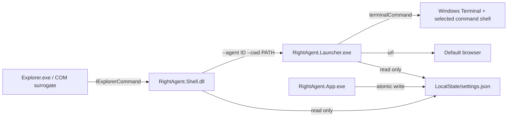

# Architecture



## Process boundaries

- `RightAgent.Shell.dll` runs in the packaged COM surrogate. It reads a small local JSON file, computes titles/icons/state, resolves one local folder, and starts the launcher. It never opens a network connection, runs an agent command, displays application UI, or writes settings.
- `RightAgent.Launcher.exe` is a GUI-subsystem executable. It validates the request and configuration, starts Windows Terminal or the default browser, reports actionable local errors, then exits.
- The settings app checks for `wt.exe` after loading. When Windows Terminal is unavailable, it presents a localized installation prompt whose primary action opens the official Microsoft Store product page; choosing Later keeps settings available and the prompt returns on the next app launch.
- `RightAgent.App.exe` is the only settings writer. It is opened from Start or the `rightagent://settings` protocol and exits when its window closes.

There is no service, tray app, startup task, scheduled task, watcher, or resident broker.

The GitHub Release `Setup.exe` is a distribution-only bootstrapper, not a
RightAgent runtime process. It embeds one signed settings MSIX, 16 signed hidden
command MSIX packages, x64 dependencies, and the public release certificate.
This split is internal: users still download and run one Setup executable.
Setup remains under the Windows user who started it, validates every package,
and requests elevation only when a first-install helper must trust the public
certificate in Local Machine\Trusted People. The helper exits before the
original user process deploys the 17-package set. Fixed Setup and
package-installation mutexes reject concurrent installation attempts. During
deployment, the PowerShell host forwards Windows `DeploymentProgress`
percentages across the complete set to Setup, which replaces its initial
indeterminate animation with a determinate progress bar.

## Explorer contract

RightAgent builds 16 independently identified command packages. Each package registers one ordered CLSID slot for both `Directory` and `Directory\Background` through `windows.fileExplorerContextMenus`. Separate package identities are required because Windows 11 groups multiple commands attributed to one package into an app flyout; separate `Application` elements inside one package are not sufficient. Every command application uses `AppListEntry="none"`, so only the primary settings application is visible in Start. All classes are served from identical copies of the same Shell DLL through packaged `windows.comServer` surrogates. Slot zero also owns the grouped submenu and single-direct modes; the other slots remain hidden outside multi-direct mode.

Slot zero returns `ECF_HASSUBCOMMANDS` in grouped mode and enumerates enabled agents in configured order. In single-direct mode it returns `ECF_DEFAULT` and invokes the selected enabled agent. In multi-direct mode every registered slot returns `ECF_DEFAULT`, resolves the enabled agent at the same configured index, and hides itself when that index does not exist. This produces genuine independent root commands; `EnumSubCommands` is not used to simulate flattening. Multi-direct mode is limited to the 16 registered slots. With no enabled agent, or when the target is not one local file-system folder, the relevant state is hidden.

For a selected folder, the path comes from `IShellItemArray` with `SIGDN_FILESYSPATH`. For a folder background, the handler resolves the current `IFolderView` through `IObjectWithSite`. The launcher path is resolved next to the loaded DLL; no registry lookup or current-directory assumption is used.

## Launch contract

The stable process boundary is:

```text
RightAgent.Launcher.exe --agent <agent-id> --cwd <absolute-directory>
```

Each argument is encoded with the Windows `CommandLineToArgvW` quoting rules. The working directory is never interpolated into the user command. Terminal actions are passed as separate arguments with this semantic shape:

```text
wt.exe -w new new-tab [-p <profile>] -d <directory> <shell-executable> <shell-options> <configured-command>
```

`terminalShell=auto` resolves PowerShell 7 (`pwsh.exe`) first and falls back to Windows PowerShell 5.1. Explicit `pwsh`, `windowsPowerShell`, and `cmd` selections use PowerShell's `-NoLogo -NoExit -EncodedCommand` or CMD's `/D /K` arguments as appropriate. PowerShell command text is Base64-encoded as UTF-16LE so Windows Terminal cannot reinterpret semicolons or quoting inside the user command. The Windows Terminal profile controls the tab profile independently; its configured command line is intentionally replaced by the selected command shell so RightAgent can execute the configured agent command.

Only the user-authored command is evaluated by the selected shell. RightAgent runs without elevation and inherits the current user's environment.

## Data and assets

The settings app writes its own `ApplicationData.Current.LocalFolder`. Native packaged components map a command package family such as `RightAgent.Command00_<publisher-id>` back to the main `RightAgent_<publisher-id>` family and read `%LOCALAPPDATA%\Packages\<main-package-family>\LocalState\settings.json`. This keeps the settings app, COM surrogate, and launcher on one file despite their independent package identities. A surviving command package also verifies that the main package is still registered and stays inert after the main app is removed. Unpackaged developer runs fall back to `%LOCALAPPDATA%\RightAgent\settings.json`. `RIGHTAGENT_SETTINGS_PATH` may override the location for automated tests only.

Built-in icon references use `builtin:<key>` and resolve to package-local ICO/SVG files. Custom files are copied into `LocalState\Icons` and stored as `local:Icons/<file>`. Native validation rejects absolute, parent-relative, or network icon paths.
