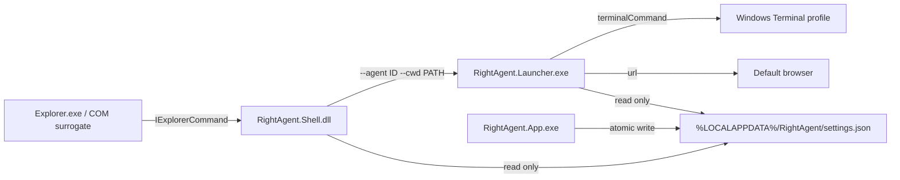

# Architecture



## Process boundaries

- `RightAgent.Shell.dll` runs in the packaged COM surrogate. It reads a small local JSON file, computes titles/icons/state, resolves one local folder, and starts the launcher. It never opens a network connection, runs an agent command, displays application UI, or writes settings.
- `RightAgent.Launcher.exe` is a GUI-subsystem executable. It validates the request and configuration, starts Windows Terminal or the default browser, reports actionable local errors, then exits.
- The settings app checks for `wt.exe` after loading. When Windows Terminal is unavailable, it presents a localized installation prompt whose primary action opens the official Microsoft Store product page; choosing Later keeps settings available and the prompt returns on the next app launch.
- `RightAgent.App.exe` is the only settings writer. It is opened from Start or the `rightagent://settings` protocol and exits when its window closes.

There is no service, tray app, startup task, scheduled task, watcher, or resident broker.

The public GitHub Release installer is a WiX 7 Burn `Setup.exe` (the same
shape as PowerToysSetup): one executable that embeds a per-machine MSI. It
requires administrator approval and installs the unpackaged settings app into
`%ProgramFiles%\RightAgent`. A per-user `UserSetup.exe` can still be built
locally into `%LOCALAPPDATA%\Programs\RightAgent`; it is not uploaded with
the public Release. Both SKUs embed 16 signed hidden command MSIX packages
and the public release certificate, and create a Start menu shortcut plus the
`rightagent:` protocol. Users download and run one Setup executable. Setup
validates every command package, imports the public certificate into Local
Machine\Trusted People when needed, caches all 16 command MSIX files under
`%LOCALAPPDATA%\RightAgent\CommandPackages`, and registers only the slots
required by the current settings. A package-installation mutex serializes
command-package work. The Burn UI shows its own progress bar while the
embedded MSI runs.

## Explorer contract

RightAgent builds 16 independently identified command packages. Each package registers one ordered CLSID slot for both `Directory` and `Directory\Background` through `windows.fileExplorerContextMenus`. Separate package identities are required because Windows 11 groups multiple commands attributed to one package into an app flyout; separate `Application` elements inside one package are not sufficient. Every command application uses `AppListEntry="none"`, so only the primary settings application is visible in Start. All classes are served from identical copies of the same Shell DLL through packaged `windows.comServer` surrogates. Slot zero also owns the grouped submenu and single-direct modes.

Setup still embeds all 16 command MSIX files and copies them into `%LOCALAPPDATA%\RightAgent\CommandPackages`, but it only registers the slots required by the current settings: slot zero on a clean machine, none when the menu is off or no agent is enabled, slot zero for grouped and single-direct, and one slot per enabled agent in multi-direct mode. The settings app keeps that occupancy in sync after later mode or agent changes; the orchestration lives in RightAgent.Core (CommandPackageSynchronizer over an injectable ICommandPackageDeployment seam) so it is unit-testable outside the WinUI app. After a package add or remove it recycles only the RightAgent COM surrogates and broadcasts `SHChangeNotify(SHCNE_ASSOCCHANGED)`; it does not terminate `explorer.exe`, because killing the shell also tears down the taskbar and often leaves it stuck. Unused slots must stay unregistered rather than merely hidden, because Explorer paints a placeholder for every registered packaged verb before it calls `GetState`. Hidden slots still return `ECS_HIDDEN` and refuse a title if Explorer instantiates them.

Slot zero returns `ECF_HASSUBCOMMANDS` in grouped mode and enumerates enabled agents in configured order. In single-direct mode it returns `ECF_DEFAULT` and invokes the selected enabled agent. In multi-direct mode every installed slot returns `ECF_DEFAULT` and resolves the enabled agent at the same configured index. This produces genuine independent root commands; `EnumSubCommands` is not used to simulate flattening. Multi-direct mode is limited to the 16 command slots. With no enabled agent, or when the target is not one local file-system folder, the relevant state is hidden.

For a selected folder, the path comes from `IShellItemArray` with `SIGDN_FILESYSPATH`. For a folder background, the handler resolves the current `IFolderView` through `IObjectWithSite`. The launcher path is resolved next to the loaded DLL; no registry lookup or current-directory assumption is used.

## Launch contract

The stable process boundary is:

```text
RightAgent.Launcher.exe --agent <agent-id> --cwd <absolute-directory>
```

Each argument is encoded with the Windows `CommandLineToArgvW` quoting rules. The working directory is never interpolated into the user command. Terminal actions are passed as separate arguments with this semantic shape:

```text
wt.exe -w new new-tab -p <profile> -d <directory> --appendCommandLine -- <profile-shell-suffix>
```

The selected Windows Terminal profile is the shell. RightAgent does not pick `pwsh`/`cmd` separately and does not replace the profile command line. `--appendCommandLine` keeps that profile's executable (PowerShell, CMD, Git Bash, VsDevCmd, WSL) and only appends the agent command as separate argv tokens. PowerShell families get `-NoLogo`, `-NoExit`, `-EncodedCommand`, and the payload; a bare `cmd.exe` profile gets `/D`, `/K`, and the command; a profile that already runs `cmd /k` (including Developer Command Prompt) gets `&&` then the command; Bash gets `-c` and `<command>; exec bash -i -l`. PowerShell command text is Base64-encoded as UTF-16LE so Windows Terminal cannot reinterpret semicolons inside the user command. Each flag stays its own argument so PowerShell 7 does not treat the suffix as a `-File` path. The settings app lists visible profiles from the user's Terminal `settings.json` and stores either `null` for “use Terminal default” or the selected profile GUID. When `terminalProfile` is empty, the launcher still passes `-p` with Terminal's `defaultProfile`.

Only the user-authored command is evaluated by the selected shell. RightAgent runs without elevation. The launcher resets `LOCALAPPDATA`, `APPDATA`, `TEMP`, and `TMP` to the real user profile so packaged command hosts do not pass a redirected AppData hive into Windows Terminal.

## Data and assets

The settings app and native command packages share `%LOCALAPPDATA%\RightAgent\settings.json`. Setup writes `%LOCALAPPDATA%\RightAgent\install.json` with the unpackaged `RightAgent.App.exe` path and the command-package identity (`RightAgent` / `CN=RightAgent` for release). A surviving command package stays inert unless that app still exists, so removing the settings app hides the menu. A full uninstall from Apps & features removes the registered command packages, the `%LOCALAPPDATA%\RightAgent` data directory, and the public certificate from Local Machine\Trusted People, then broadcasts `SHChangeNotify`. It does not terminate `explorer.exe`. A major upgrade keeps settings and the certificate so the new Setup can reuse them. `RIGHTAGENT_SETTINGS_PATH` may override the location for automated tests only. An older packaged settings install is migrated off `Packages\<family>\LocalState` the first time the new Setup runs, then the leftover main MSIX is removed.

Built-in icon references use `builtin:<key>` and resolve to package-local ICO/SVG files. Custom files are copied into `%LOCALAPPDATA%\RightAgent\Icons` and stored as `local:Icons/<file>`. Native validation rejects absolute, parent-relative, or network icon paths.
