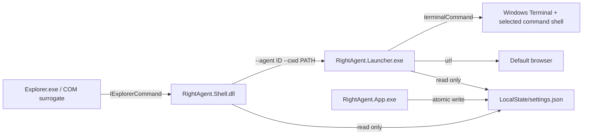

# Architecture



## Process boundaries

- `RightAgent.Shell.dll` runs in the packaged COM surrogate. It reads a small local JSON file, computes titles/icons/state, resolves one local folder, and starts the launcher. It never opens a network connection, runs an agent command, displays application UI, or writes settings.
- `RightAgent.Launcher.exe` is a GUI-subsystem executable. It validates the request and configuration, starts Windows Terminal or the default browser, reports actionable local errors, then exits.
- The settings app checks for `wt.exe` after loading. When Windows Terminal is unavailable, it presents a localized installation prompt whose primary action opens the official Microsoft Store product page; choosing Later keeps settings available and the prompt returns on the next app launch.
- `RightAgent.App.exe` is the only settings writer. It is opened from Start or the `rightagent://settings` protocol and exits when its window closes.

There is no service, tray app, startup task, scheduled task, watcher, or resident broker.

The GitHub Release `Setup.exe` is a distribution-only bootstrapper, not a
RightAgent runtime process. It embeds the signed MSIX, x64 dependencies, and
public release certificate. Setup remains under the Windows user who started
it, validates the package, and requests elevation only when a first-install
helper must trust the public certificate in Local Machine\Trusted People. The
helper exits before the original user process deploys the MSIX. Fixed Setup and
package-installation mutexes reject concurrent installation attempts. During
deployment, the PowerShell host forwards Windows `DeploymentProgress`
percentages to Setup, which replaces its initial indeterminate animation with a
determinate progress bar.

## Explorer contract

The MSIX manifest registers one root CLSID for both `Directory` and `Directory\Background` through `windows.fileExplorerContextMenus`. The class is served by the Shell DLL through one `windows.comServer` surrogate registration.

The root command returns `ECF_HASSUBCOMMANDS` in grouped mode and enumerates enabled agents in configured order. In direct mode it returns `ECF_DEFAULT` and invokes the selected enabled agent. In multi-direct mode it returns `ECF_ISSEPARATOR` and enumerates enabled agents with full direct-action titles, allowing the Windows 11 menu to expand those commands at the same menu level. Multi-direct mode is limited to 16 enabled agents to stay within the modern menu's practical command bound. With no enabled agent, or when the target is not one local file-system folder, the relevant state is hidden.

For a selected folder, the path comes from `IShellItemArray` with `SIGDN_FILESYSPATH`. For a folder background, the handler resolves the current `IFolderView` through `IObjectWithSite`. The launcher path is resolved next to the loaded DLL; no registry lookup or current-directory assumption is used.

## Launch contract

The stable process boundary is:

```text
RightAgent.Launcher.exe --agent <agent-id> --cwd <absolute-directory>
```

Each argument is encoded with the Windows `CommandLineToArgvW` quoting rules. The working directory is never interpolated into the user command. Terminal actions are passed as separate arguments with this semantic shape:

```text
wt.exe -w new new-tab [-p <profile>] -d <directory> <shell-executable> <shell-options> <configured-command>
```

`terminalShell=auto` resolves PowerShell 7 (`pwsh.exe`) first and falls back to Windows PowerShell 5.1. Explicit `pwsh`, `windowsPowerShell`, and `cmd` selections use PowerShell's `-NoLogo -NoExit -EncodedCommand` or CMD's `/D /K` arguments as appropriate. PowerShell command text is Base64-encoded as UTF-16LE so Windows Terminal cannot reinterpret semicolons or quoting inside the user command. The Windows Terminal profile controls the tab profile independently; its configured command line is intentionally replaced by the selected command shell so RightAgent can execute the configured agent command.

Only the user-authored command is evaluated by the selected shell. RightAgent runs without elevation and inherits the current user's environment.

## Data and assets

Packaged components share `%LOCALAPPDATA%\Packages\<package-family>\LocalState\settings.json`. Unpackaged developer runs fall back to `%LOCALAPPDATA%\RightAgent\settings.json`. `RIGHTAGENT_SETTINGS_PATH` may override the location for automated tests only.

Built-in icon references use `builtin:<key>` and resolve to package-local ICO/SVG files. Custom files are copied into `LocalState\Icons` and stored as `local:Icons/<file>`. Native validation rejects absolute, parent-relative, or network icon paths.
